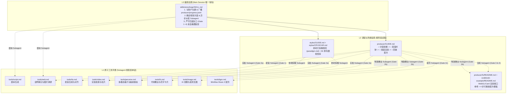
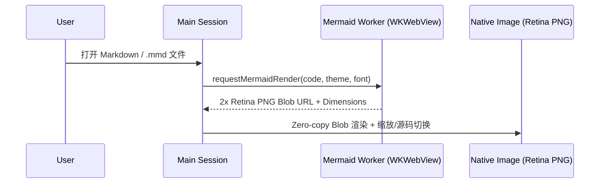

# 一、文档分层与主从 Subagent 职责架构

StoryForge 技能包按三层结构组织，主 Session 与 6 类专职 Subagent 各司其职：

```mermaid
flowchart TB
    subgraph L3_Layer["L3 编排总纲 (Main Session 唯一常驻)"]
        SKILL["skills/storyforge/SKILL.md
        1. 与用户沟通 & 广播 producer/progress.jsonl
        2. 确定视觉方案 & 异步派发 Subagent
        3. 严守四道关口 (Gate 1~4) 亲自看图验货"]
    end

    subgraph L2_Layer["L2 流程与风格指南 (按阶段读取)"]
        PGUIDE["producer/GUIDE.md
        ○ 分镜拆解 -> ○ 配音时钟 -> ○ 组装渲染 -> ○ 回放配方"]
        SGUIDE["styles/GUIDE.md + styles/OPUSCAR.md
        参考片拆解规范 (paradigm.md) + 81 种专题视觉库"]
        FXREADME["producer/fx/README.md + codebook-example/README.md
        WebGL/Card 渲染接口参考 + 4 步可重放配方模板"]
    end

    subgraph L1_Layer["L1 原子工具手册 (Subagent 按职责单读)"]
        T_Script["tools/script.md
        剧本生成"]
        T_Web["tools/web.md
        全网事实与图片调研"]
        T_TTS["tools/tts.md
        配音合成与对齐"]
        T_Video["tools/video.md
        实拍检索与拉片"]
        T_Perceive["tools/perceive.md
        多模态看片与抽帧核验"]
        T_FX["tools/fx.md
        代码舞台与花字卡片"]
        T_Img["tools/image.md
        AI 纹理与道具生图"]
        T_BGM["tools/bgm.md
        MiniMax Music 3 配乐"]
    end

    SKILL --> PGUIDE & SGUIDE
    SGUIDE -.->|"参考拆解 Subagent"| T_Video & T_Perceive
    SKILL -.->|"剧本 Subagent"| T_Script & T_Web
    PGUIDE -.->|"配音 Subagent (Gate 1)"| T_TTS
    PGUIDE -.->|"实拍 Subagent (Gate 2a)"| T_Video & T_Perceive & T_Web
    PGUIDE -.->|"特效舞台 Subagent (Gate 2b)"| T_FX & T_Img & FXREADME
    PGUIDE -.->|"配乐 Subagent (Gate 2c)"| T_BGM
    PGUIDE -.->|"合成 Subagent (Gate 3 & 4)"| FXREADME
```

## 二、端到端渲染时序

```mermaid
sequenceDiagram
    participant U as User
    participant M as Main Session
    participant W as Mermaid Worker (WKWebView)
    participant N as Native Image (Retina PNG)
    U->>M: 打开 Markdown / .mmd 文件
    M->>W: requestMermaidRender(code, theme, font)
    W-->>M: 2x Retina PNG Blob URL + Dimensions
    M->>N: Zero-copy Blob 渲染 + 缩放/源码切换
```
